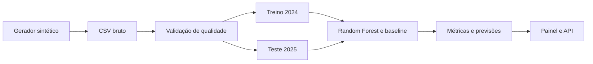

# Atlas — PI IV

Laboratório territorial reproduzível que gera uma base sintética, valida sua qualidade, treina e avalia um classificador e apresenta os resultados em um painel acessível.

O projeto é uma fundação técnica para o **Projeto Integrador em Computação IV (PJI410)** ou **Projeto Integrador Extensionista IV**, conforme a matriz vigente na matrícula. Ele cobre o núcleo comum dos PPCs de 2025 e 2026: aquisição e processamento de dados, análise, aprendizagem de máquina, visualização, ambiente reproduzível e interpretação responsável.

> **Aviso:** nomes, territórios e dados deste repositório são inteiramente sintéticos. Os resultados não descrevem lugares reais e não podem orientar decisões públicas. A etapa extensionista exige parceiro, problema e dados ou validações reais, que não devem ser inventados.

## O que já funciona

- geração determinística de 288 observações, em 12 territórios fictícios e 24 meses;
- validação de esquema, origem, ausência de nulos e faixas numéricas;
- pipeline com preparação, codificação categórica e Random Forest;
- avaliação temporal: treino em 2024 e teste em 2025;
- comparação obrigatória com `DummyClassifier`;
- exportação de métricas, matriz de confusão, previsões e agregações;
- painel Flask responsivo e API JSON;
- testes automatizados e integração contínua.

Na execução de referência, o modelo obteve **76,39% de acurácia** e **76,60% de F1 macro**, contra **50% de acurácia da linha de base**. Essas métricas apenas verificam a estrutura sintética do experimento.

## Executar no Windows

Requer Python 3.14.

```powershell
python -m venv .venv
.\.venv\Scripts\python.exe -m pip install -r requirements.txt
.\.venv\Scripts\python.exe scripts\generate_demo_data.py
.\.venv\Scripts\python.exe -m atlas.pipeline
.\.venv\Scripts\python.exe -m atlas.web
```

Acesse `http://127.0.0.1:3003`.

## Testes

```powershell
.\.venv\Scripts\python.exe -m unittest discover -s tests -v
.\.venv\Scripts\python.exe -m pip check
```

## Fluxo dos dados



## Estrutura

```text
atlas/       pipeline e aplicação Flask
data/raw/    conjunto sintético versionado
artifacts/   métricas, agregações e previsões reproduzíveis
scripts/     gerador da demonstração
templates/   páginas do painel e do método
static/      identidade visual responsiva
tests/       testes do pipeline e da aplicação
docs/        método, dados e revisão de código
```

O modelo serializado não é versionado porque pode ser recriado pelo pipeline. Consulte [Método e dados](docs/01-metodo-e-dados.md) e [Revisão de código](docs/02-revisao-de-codigo.md).

## Próximos passos acadêmicos

1. confirmar no AVA se a oferta usa PJI IV ou PIE IV;
2. selecionar uma organização ou comunidade parceira;
3. validar a pergunta analítica e os critérios de sucesso;
4. substituir ou complementar a demonstração somente com dados autorizados;
5. realizar devolutiva, análise dos resultados, relatório final e vídeo.

Nenhuma dessas evidências extensionistas é simulada neste repositório.
